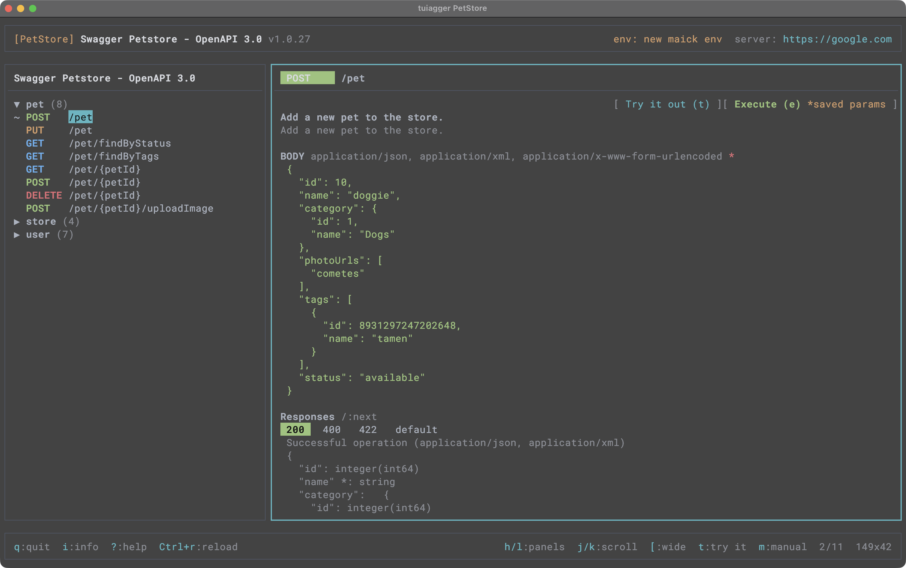

# TUIagger

> Pronounced **"TOO-ee-agger"** — TUI ("tooey") + agger (from sw**agger**).

A terminal-based UI for viewing and interacting with OpenAPI/Swagger documentation. Navigate endpoints, execute requests, and manage API collections — all without leaving the terminal.

<div align="center">
  <picture>
    
  </picture>
</div>

## Features

- **Two-panel layout** — scrollable tag/endpoint list on the left, details on the right
- **Try it out** — execute requests directly from the terminal with live responses, including a HEADERS table separate from query/path PARAMETERS
- **Manual request builder** — create and save custom requests not in the spec
- **Collections** — store named API specs in `~/.tuiagger/` for quick access
- **Environments** — named variable sets (`dev`, `staging`, `prod`) with `{{variable}}` interpolation
- **Faker interpolation** — generate realistic test data with `{{faker.internet.email()}}` syntax
- **Auth support** — configure Bearer token, Basic auth, or API key in the info panel
- **Server switching** — select from servers defined in the spec
- **Visual response selection** — enter visual mode to select and yank response body lines
- **Curl generation** — every executed request shows its equivalent curl command in its own colored section, with a dedicated shortcut to yank it to the clipboard

## Installation

### Homebrew (macOS)

```bash
brew tap valVK/tuiagger
brew install tuiagger
```

### Uninstall

```bash
brew uninstall tuiagger
brew untap valVK/tuiagger
```

### From source

Requires Go 1.26+.

```bash
git clone https://github.com/valVK/tuiagger
cd tuiagger
go build -o /usr/local/bin/tuiagger ./cmd/tuiagger
```

Or, with [Task](https://taskfile.dev) installed:

```bash
task build   # builds to ./bin/tuiagger
```

## Usage

```bash
# Load a saved collection
tuiagger PetStore

# Load from a local file
tuiagger ./openapi.json

# Load from a URL
tuiagger https://petstore3.swagger.io/api/v3/openapi.json

# List saved collections
tuiagger --list

# Show version
tuiagger --version
```

## Collections

Collections are directories under `~/.tuiagger/<name>/` containing an OpenAPI spec file.

```bash
# Create a collection
mkdir -p ~/.tuiagger/MyAPI
cp openapi.json ~/.tuiagger/MyAPI/

# Open it
tuiagger MyAPI
```

Saved manual requests, try-it-out overrides, and auth/environment config are stored per-collection as JSON files alongside the spec (writes are atomic — write-to-`.tmp`-then-rename — so a killed process mid-write can't corrupt them).

## Keyboard Shortcuts

Press `?` inside tuiagger to open the full interactive cheatsheet — it always reflects exactly what's implemented, so treat it as the definitive reference over this table if the two ever disagree.

### Global

| Key | Action |
|-----|--------|
| `q` | Quit |
| `Ctrl+R` | Reload spec |
| `i` | Open info panel (servers / auth / environments) |
| `[` | Toggle left panel width |
| `?` | Toggle help cheatsheet |

### Navigation

| Key | Action |
|-----|--------|
| `h` / `←` | Focus left panel |
| `l` / `→` | Focus right panel |

### Left Panel

| Key | Action |
|-----|--------|
| `j` / `k` | Move down / up |
| `Enter` | Expand / collapse tag |
| `g` / `G` | First / last item |
| `c` / `x` | Collapse / expand all tags |
| `R` | Rename tag (custom tags only) |
| `D` | Delete tag, with confirm if non-empty (custom tags only) |

### Right Panel (browse)

| Key | Action |
|-----|--------|
| `j` / `k` | Scroll content |
| `g` | Scroll to top |
| `t` | Enter try-it-out mode |
| `e` | Quick execute (reuses saved overrides) — works from either panel |
| `m` | Open manual request builder |
| `E` | Edit selected saved request |
| `D` | Delete selected saved request |
| `\` | Toggle request / response tab |
| `/` | Cycle response status tabs |

### Try It Out

| Key | Action |
|-----|--------|
| `e` | Execute request |
| `p` | Edit path override |
| `m` | Cycle HTTP method |
| `r` | Reset overrides |
| `Esc` | Exit try-it-out |
| `k` (at first PARAMETERS row) | Focus the HEADERS section |
| `j` (past last param) | Focus the BODY section |
| `i` (body focused) | Edit body (scaffolds realistic data if empty) |
| `k` / `Esc` (body focused) | Back to parameters / exit try-it-out |

### Parameters / Headers

| Key | Action |
|-----|--------|
| `j` / `k` | Navigate rows |
| `i` | Edit value |
| `←` / `→` | Cycle enum values (PARAMETERS only) |
| `d` | Toggle enable / disable |
| `x` | Delete custom row |
| `c` | Cycle param type — query / path (PARAMETERS only; HEADERS entries are always type "header") |

### Response Body

| Key | Action |
|-----|--------|
| `J` / `K` | Scroll down / up |
| `j` / `k` | Also work as J/K while a visual selection is active |
| `g` / `G` | Jump to top / bottom |
| `v` | Toggle visual selection mode |
| `y` | Yank selection (or full body) to clipboard |
| `C` | Yank the generated curl command to clipboard |
| `Esc` | Cancel visual mode |

### Info Panel (`i`)

| Key | Action |
|-----|--------|
| `Tab` | Switch section (Servers / Auth / Environments) |
| `j` / `k` | Navigate items |
| `Enter` | Select server / activate environment |
| `Esc` | Close panel |

### Environments

| Key | Action |
|-----|--------|
| `n` | New environment |
| `e` | Edit variables |
| `x` | Delete environment |
| `i` | Add / edit variable |
| `Esc` | Back to environment list |

### Manual Request (`m`)

| Key | Action |
|-----|--------|
| `p` | Edit path |
| `m` | Cycle HTTP method |
| `e` | Execute request |
| `s` | Save request (opens name/tag dialog) |
| `d` | Delete request (only while editing a saved request via `E`) |
| `Esc` | Close (discards an unsaved draft) |
| `k` (at first PARAMETERS row) | Focus the HEADERS section |
| `j` (past last param, write methods only) | Focus the BODY section |

## Request Body Content Types

When an endpoint (in Try It Out) or a manual request declares more than one request body format, cycle through them with `c` while BODY is focused: `application/json`, `application/x-www-form-urlencoded`, `application/xml`. The body is re-scaffolded for whichever type is selected, and the `Content-Type` header sent on execute always matches it.

### application/x-www-form-urlencoded

The BODY box shows and accepts plain, unescaped `key=value` lines — not the actual percent-encoded wire text. Percent-encoding happens automatically right before the request is sent, so you never have to hand-encode spaces (`%20`/`+`), punctuation, or other special characters yourself.

| Data type | In the BODY box | Sent on the wire |
|---|---|---|
| String | `name=doggie` | `name=doggie` |
| Number | `id=10` | `id=10` |
| Boolean | `available=true` | `available=true` |
| Array of strings/numbers | `tags=a`<br>`tags=b` | `tags=a&tags=b` |
| Nested object | `category={"id":1,"name":"Dogs"}` | `category=%7B%22id%22%3A1%2C%22name%22%3A%22Dogs%22%7D` |
| Array of objects | `photos=[{"url":"a.png"}]` | `photos=%5B%7B%22url%22%3A%22a.png%22%7D%5D` |

Full example — everything above combined into one body:

```
name=doggie
id=10
available=true
weight=12.5
tags=a
tags=b
category={"id":1,"name":"Dogs"}
photos=[{"url":"a.png"}]
```

is sent as:

```
name=doggie&id=10&available=true&weight=12.5&tags=a&tags=b&category=%7B%22id%22%3A1%2C%22name%22%3A%22Dogs%22%7D&photos=%5B%7B%22url%22%3A%22a.png%22%7D%5D
```

A plain array (strings, numbers, booleans) repeats the key once per item — matching how HTML forms encode multi-value fields. A nested object, or an array containing objects, has no natural flat form-field shape, so it's shown and sent as a single compact-JSON value for that key instead.

## Faker Interpolation

Use `{{faker.*.*()}}` syntax in parameter values and request bodies to generate realistic test data:

```
{{faker.internet.email()}}
{{faker.person.fullName()}}
{{faker.string.uuid()}}
{{faker.number.int()}}
```

## Environment Variables

Create environments in the info panel (`i` → Tab to Environments) and reference variables with `{{variableName}}` in parameter values, headers, and request bodies:

```
base_url  =  https://staging.api.example.com
api_key   =  sk-staging-abc123
```

Then use `{{base_url}}` or `{{api_key}}` anywhere in your request. The active environment is shown in the header bar.

## Development

```bash
task check    # gofmt-check + go vet + go test — run before committing
task run -- PetStore   # build and run against a collection
task smoke    # copy the bundled Petstore fixture into ~/.tuiagger/PetStore and launch it
```

Test with the Petstore API:
```
https://petstore3.swagger.io/api/v3/openapi.json
```

Run `task` with no arguments to list every available task (build, run, test, vet, fmt, vendor, clean).

## Tech Stack

- [Bubbletea](https://github.com/charmbracelet/bubbletea) — Elm-architecture TUI framework
- [Lipgloss](https://github.com/charmbracelet/lipgloss) — terminal styling
- [Bubbles](https://github.com/charmbracelet/bubbles) — text input / textarea components
- [pb33f/libopenapi](https://github.com/pb33f/libopenapi) — OpenAPI 3.0.x/3.1.x parsing
- [gofakeit](https://github.com/brianvoe/gofakeit) — test data generation
- Go

## License

MIT
